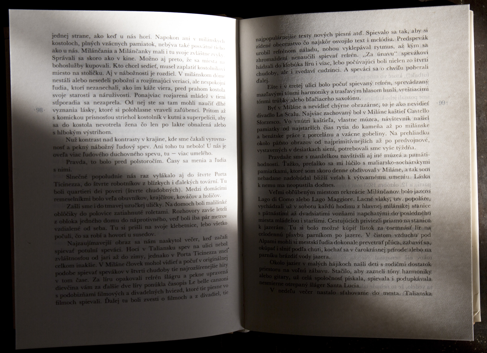
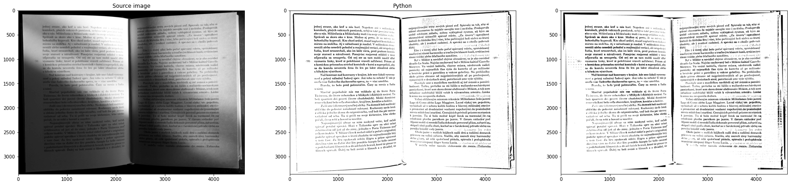

# Отчет по лаборатоной работе LW1
    Работу выполнил: Козлов Евгений

## Описание задачи:

В задании требуется реализовать программу для бинаризации изображений с использованием адаптивного   порога. Программа должна отображать окно с изображением, которое можно переключать   между черно-белым и бинаризованнымсостояниями по нажатию клавиши.
Также необходимо сравнить быстродействие методов. 

## Теоритическая база:

Бинаризация изображения - это процесс преобразования изображения в двухцветное (черно-белое) изображение, где каждый пиксель принимает значение либо белого (255), либо черного (0).

<b>Адаптивный порог</b>: При использовании глобального порога для бинаризации изображения, одно пороговое значение применяется ко всем пикселям изображения. Однако в некоторых случаях освещение на изображении может быть неравномерным, что делает глобальную бинаризацию неэффективной. Адаптивная бинаризация позволяет использовать локальные пороговые значения в зависимости от интенсивности пикселей в их окрестности.

<b>Методы адаптивной бинаризации</b>: Существует несколько методов адаптивной бинаризации, один из которых - метод среднего значения. При этом методе пороговое значение вычисляется как среднее значение интенсивности пикселей в окрестности каждого пикселя с учетом заданного размера окна.

## Описание разработанной системы:  
Работа выполнялась на языке программирования Python 3.9.7 и использованием следующий дополнительных пакетов

* numpy - пакет с линейной алгреброй
* OpenCV - огромный пакет с алгоритмами для обработки изображений
* numba - пакет для оптимизации производительности кода
* matplotlib - пакет для визуализаций
* time - замер времени
* tqdm - красивый статус-бар

Была написана функция, копируящая функционал 

    cv2.adaptiveThreshold(
        source_image,
        max_val,
        cv2.ADAPTIVE_THRESH_MEAN_C,
        cv2.THRESH_BINARY,
        block_size,
        C,
    )
    где сv2.ADAPTIVE_THRESH_MEAN_C, cv2.THRESH_BINARY, max_val будут константнами параметрами.

    Причина в том, что
    cv2.ADAPTIVE_THRESH_MEAN_C - каким образом мы будем выбирать локальный порог бинаризации.
    cv2.THRESH_BINARY - будет изображение черно-белым или бело-черным, не играет существенной разницы.

В рамках лаборатрной работы были написаны 2 файла: 
1. `lw1.py` - реализация 3 методов для адаптивной бинаризации:
    * Нативная реализация из OpenCV
    * C использованием Python + numpy

    Также интерфейс взаимодействия в виде интерактивного окна из OpenCV.  
    При помощи клавиатуры можно переключать отображения сходного изображения. 
    Исходное изображение рисуется по умолчанию. 

    Элементы управления: 

    * кнопка "1" - Показ исходного изображения
    * кнопка "2" - Пока изображения с адаптивной бинаризацией из OpenCV
    * кнопка "3" - Показ изображения с адаптивной бинаризацией Python+numpy
    * кнопка "4" - Показ изображения с адаптивной бинаризацией Python+numpy+numbaдава

2. `speed_comp.py` - скрипт для сравнения скоростей адаптивной бинаризации из `lw1.py`

## Результаты выполнения

Для теста была выбранно изображение книги:

Изображение такого рода поможет нам понять насколько хорошо прошла бинаризация, так как на нем присутствует много
маленьких и различных деталей, глобальные и локальные тени.

Реализованный метод адаптивной бинаризации отработал почти точь-в-точь как исходный:
`Block size = 15` и `C = 15`

### Анализ параметров
#### Block size

Block size - размер участка, на котором мы производим вычисление локальной порога бинарзиции и применяем к выбранному участку.

В собственной реализации проявляются определенные дефекты - на изображении появляются "кусковые" участки, размером с шириной области, по которой мы проводим расчет локальной бинаризации.
Данный эффект возрастает при увеличении области (константа C остается неизменной).

`Block size = 51`

`Block size = 151`

`Block size = 251`

Уменьшение размера области влияет на качество адаптивной бинаризации:

`Block size = 3`

`Block size = 5`

`Block size = 7`

`Block size = 9`

`Block size = 11`

`Block size = 15`

#### С-константа

Данной константой мы регуляризируем все пиксели и влияем на баланс между числом черных и белых пикселей. Таким образом получается компенсировать различия в яркости между локальными областями изображения.
Для демонстрации придем пример результатов при разных `С` и фиксированным `block_size=15`

`C = 3`

`C = 5`

`C = 7`

`C = 15 (Субъективно наилучший вариант)`

`C = 21`

`C = 45`

`C = 65`

`C = 100`

Вывод:

Размер области существенно влияет на качество бинаризации, так как уменьшает или увеличивает область, по которой 
считается порог. Чем больше область, тем изображение становится более контрастным и начинает появляться излишняя информация (тени), также в самостоятельной реализации значимо проявляются артефакты сдвига. В таких артефактах замечается закономерность в виде дублирования информации из локальных контрастных участков (углы, тени, сгибы) книги.
Причиной таких артефактов может являеться неуказанное сглаживание и обротка контуров, присутствующая в OpenCV.
При уменьшении области инофрмация начинает пропадать, вплоть до монотонного белого цвета. 

В свою очередь параметр C сильно влияет на качество бинаризации: при его низком значений начинаю проявляться шумы, а при высоком слишком много информации начинает пропадать (вплость до полного исчезновения).

Эмпирически выявлено, что при `block_size ~= 51` и `С = 7` достигается наиболее качетсвенный результат.

### Сравнение скорости инференса

Данный экспермент проводится в файле `speed_comp.py`.

Существенный вклад с скорость инференса может вносить только `размер изображения` и параметр `block_size`. Будем измерять скорость работы, путем перебора второго параметра.
Как упоминалась, третий вариант функции является, по сути, вторым, но задекорированным `@njit`.
Таким образом мы доверимся "магии" Numba и узнаем насколько ускорится наш код и сможет ли он приблизиться к оптимизированной версии из OpenCV.

Ход проведения:

Итерируясь по 
    block_sizes = list(range(3, 255, 2))

Мы будем вычислять адаптивную бинаризацию 3 раза для одной и тоже картинки с разным `block_size`.
Время будет замеряться при помощи собственного декоратора `@timeit` (не путать с сущствующей магической командой @timeit для jupyter notebook).

Результаты:

Как видно из графика,что такое просто действие, как навешивание декоратора `@njit` на неизмененную функцию для вычисления адаптивной бинаризации, позволило ускорить инференс и приблизиться к скорости OpenCV. Неускоренная реализация приближается только при `block_size > 25`. Таким образом `Numba` крайне эффективна при маленьких значениях `block_size`, но не дает выйигрыша при средних.

## Выводы по работе

В ходе выполнения работы был реализован алгоритм адаптивной бинаризации, используя только `Python` и `Numpy`. Несмотря на наличие дефектов сдвига, реализация была успешна и позволяет получать результат, схожий с исходной реализацей из пакета `OpenCV`. Был проведен эксперимент по ускорению скорости работы алгоритма при помощи пакета `Numba`, который позволил приблизить результат к `OpenCV`. Особенно эффективно оптимизация продемонстрировала себя на параметрах, которые производили самые интенсивные операции.

## Использованные источники

https://docs.opencv.org/4.x/d7/d4d/tutorial_py_thresholding.html

https://numpy.org/doc/

https://matplotlib.org/stable/users/index.html

https://numba.pydata.org/numba-doc/latest/index.html
